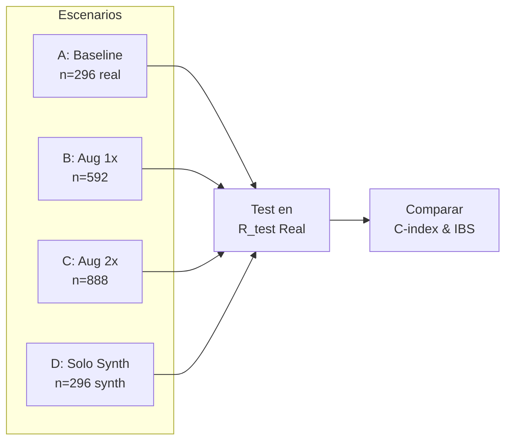
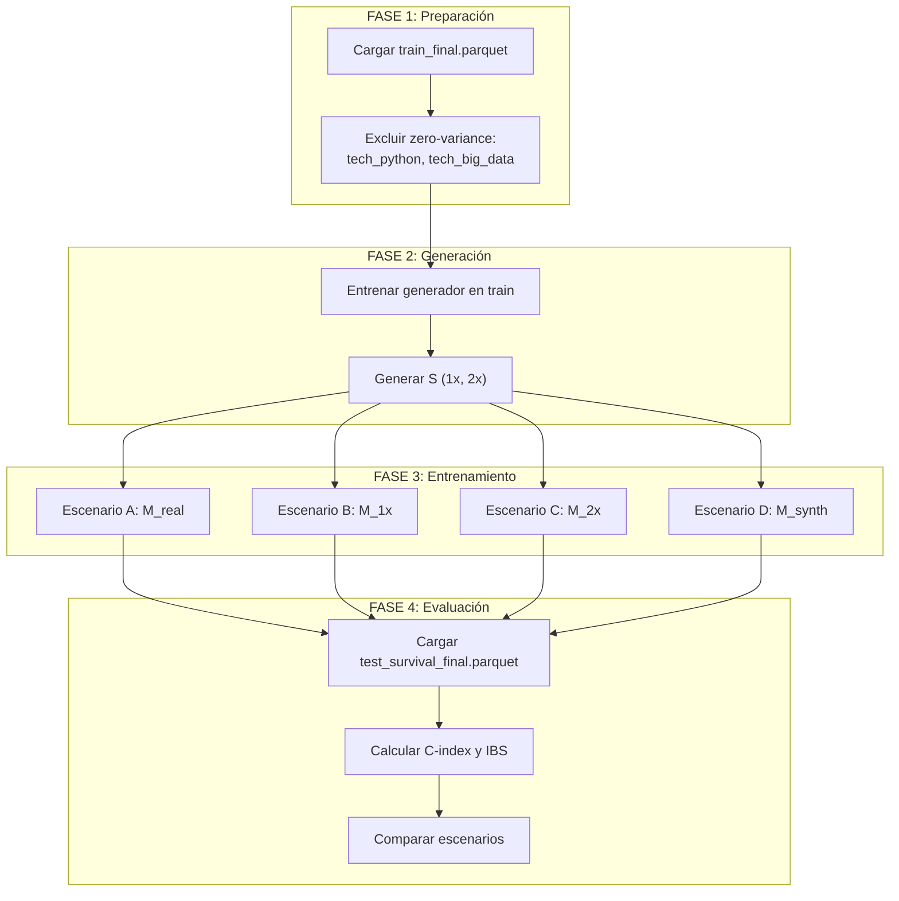

# Protocolo Experimental TSTR
## Validación de Datos Sintéticos para Análisis de Supervivencia

**Versión:** 1.0  
**Fecha:** 2026-01-08  
**Autor:** Investigador Principal (Metodología)

---

## 1. Introducción y Justificación

Este protocolo define la metodología **Train on Synthetic, Test on Real (TSTR)** para validar la utilidad de datos sintéticos en el contexto de análisis de supervivencia aplicado al tiempo-al-primer-empleo de graduados universitarios.

### 1.1 Problema Central
Según el diagnóstico realizado (`dataset_diagnosis.json`):
- **n = 296** observaciones reales
- **Censura:** 54.4% (161 censurados, 135 eventos)
- **Duración:** 0.58 - 30.0 meses (μ = 15.4, σ = 11.0)

El tamaño muestral limitado y la alta tasa de censura dificultan el entrenamiento de modelos predictivos robustos.

### 1.2 Hipótesis
> *La augmentación con datos sintéticos que preserven las restricciones de dominio y la correlación duration-event puede mejorar el poder predictivo de modelos de supervivencia.*

---

## 2. Fundamento Científico

### 2.1 Metodología TSTR

La metodología TSTR es el estándar para evaluar la utilidad de datos sintéticos (Xu et al., 2019; Mostly AI, 2024):

```
┌─────────────────┐     ┌─────────────────┐     ┌─────────────────┐
│   R_train       │ ──▶ │   Generador     │ ──▶ │   S (Synthetic) │
│   (Real Train)  │     │   Sintético     │     │                 │
└─────────────────┘     └─────────────────┘     └─────────────────┘
                                                        │
                                                        ▼
┌─────────────────┐     ┌─────────────────┐     ┌─────────────────┐
│   R_test        │ ◀── │   Modelo M      │ ◀── │   Train on S    │
│   (Real Test)   │     │   (Predicción)  │     │                 │
└─────────────────┘     └─────────────────┘     └─────────────────┘
```

### 2.2 Referencias Clave

| Referencia | Año | Aporte |
|------------|-----|--------|
| Lawless, J.F. | 2003 | Restricciones de dominio en survival (duration > 0) |
| Xu et al. (CTGAN) | 2019 | Generación sintética tabular con GANs |
| Getie Ayaneh et al. | 2020 | Modelos de supervivencia para tiempo-al-empleo |
| Suresh et al. | 2025 | TSTR para pronóstico cardíaco con datos sintéticos |
| Andonovikj et al. | 2024 | Relación duration-event en síntesis de datos |

---

## 3. Escenarios Experimentales

Se definen **4 escenarios** para evaluar el impacto de los datos sintéticos:

### Escenario A: Baseline (Solo Real)
| Aspecto | Valor |
|---------|-------|
| **Datos de Entrenamiento** | `train_final.parquet` (n=296) |
| **Datos Sintéticos** | Ninguno |
| **Propósito** | Establecer línea base de rendimiento |

### Escenario B: Augmentado 1x (Real + 100% Sintético)
| Aspecto | Valor |
|---------|-------|
| **Datos de Entrenamiento** | Real (n=296) + Sintético (n=296) |
| **Total** | n ≈ 592 |
| **Propósito** | Evaluar beneficio de duplicar el tamaño |

### Escenario C: Augmentado 2x (Real + 200% Sintético)
| Aspecto | Valor |
|---------|-------|
| **Datos de Entrenamiento** | Real (n=296) + Sintético (n=592) |
| **Total** | n ≈ 888 |
| **Propósito** | Evaluar rendimientos decrecientes |

### Escenario D: Solo Sintético (Prueba de Privacidad)
| Aspecto | Valor |
|---------|-------|
| **Datos de Entrenamiento** | Solo Sintético (n=296) |
| **Datos Reales** | Ninguno en entrenamiento |
| **Propósito** | Validar utilidad sin datos reales (privacy-preserving) |



---

## 4. Métricas de Éxito

### 4.1 Métrica Principal: C-index (Concordance Index)

El **C-index** mide la capacidad discriminativa del modelo (Harrell et al., 1996):

$$C = \frac{\sum_{i,j} \mathbf{1}[\hat{T}_i < \hat{T}_j] \cdot \mathbf{1}[T_i < T_j] \cdot \delta_i}{\sum_{i,j} \mathbf{1}[T_i < T_j] \cdot \delta_i}$$

| Interpretación | Valor |
|----------------|-------|
| Modelo aleatorio | 0.50 |
| Modelo aceptable | > 0.60 |
| Modelo bueno | > 0.70 |
| Modelo excelente | > 0.80 |

### 4.2 Métrica Secundaria: IBS (Integrated Brier Score)

El **Integrated Brier Score** mide la calibración del modelo (Graf et al., 1999):

$$IBS = \frac{1}{t_{max}} \int_0^{t_{max}} BS(t) \, dt$$

Donde:
$$BS(t) = \frac{1}{n} \sum_{i=1}^{n} \frac{(\hat{S}(t|X_i) - \mathbf{1}[T_i > t])^2}{\hat{G}(t)}$$

| Interpretación | Valor |
|----------------|-------|
| Modelo excelente | < 0.10 |
| Modelo bueno | 0.10 - 0.20 |
| Modelo aceptable | 0.20 - 0.25 |
| Modelo pobre | > 0.25 |

### 4.3 Criterio de Éxito

> [!IMPORTANT]
> **Éxito del experimento:** El C-index en cualquier escenario sintético (B, C, D) debe ser **≥ al C-index del Baseline A** en el test set real, con un margen de tolerancia de -0.02.

**Fórmula de decisión:**
```
IF C_index(Escenario_X) >= C_index(Baseline_A) - 0.02:
    Escenario_X = ÉXITO
ELSE:
    Escenario_X = DEGRADACIÓN
```

---

## 5. Estrategia Anti-Fuga (No-Leakage)

> [!CAUTION]
> **Principio Fundamental:** Los modelos se evalúan **estrictamente** en datos reales nunca vistos durante la generación sintética ni el entrenamiento.

### 5.1 Arquitectura de Datos

```
v2/data/processed/
├── train_final.parquet    ← ÚNICO dato para generar sintéticos
└── test_survival_final.parquet  ← INTOCABLE hasta evaluación final
```

### 5.2 Reglas de No-Fuga

| Regla | Descripción |
|-------|-------------|
| **R1** | `test_survival_final.parquet` **nunca** alimenta al generador |
| **R2** | El generador solo ve `train_final.parquet` |
| **R3** | Ningún hiperparámetro se optimiza en el test set |
| **R4** | La evaluación final es un **single-shot** en test |

### 5.3 Validación Cruzada Interna

Para selección de hiperparámetros del generador sintético y modelos:

```
train_final.parquet (n=296)
    ├── 80% train_internal
    └── 20% val_internal (CV folds)
```

---

## 6. Modelos a Evaluar

### 6.1 Modelos Base

| Modelo | Descripción | Librería |
|--------|-------------|----------|
| **RSF** | Random Survival Forest | `scikit-survival` |
| **XGB-AFT** | XGBoost Accelerated Failure Time | `xgboost` |
| **CoxPH** | Cox Proportional Hazards | `lifelines` |

### 6.2 Hiperparámetros por Defecto

**RSF:**
- `n_estimators`: 100
- `max_depth`: 5
- `min_samples_split`: 10

**XGB-AFT:**
- `objective`: survival:aft
- `aft_loss_distribution`: normal
- `n_estimators`: 100
- `max_depth`: 3

---

## 7. Pipeline de Ejecución



---

## 8. Formato de Resultados

### 8.1 Tabla de Resultados Esperada

| Escenario | n_train | C-index | IBS | Δ vs Baseline |
|-----------|---------|---------|-----|---------------|
| A (Baseline) | 296 | ? | ? | — |
| B (Aug 1x) | 592 | ? | ? | ? |
| C (Aug 2x) | 888 | ? | ? | ? |
| D (Solo Synth) | 296 | ? | ? | ? |

### 8.2 Archivo de Salida

Los resultados se guardarán en:
```
v3_experimental/04_results/tstr_results.json
```

Con estructura:
```json
{
  "experiment_id": "TSTR_v1",
  "date": "YYYY-MM-DD",
  "scenarios": {
    "A_baseline": {"c_index": X, "ibs": Y},
    "B_aug_1x": {"c_index": X, "ibs": Y},
    "C_aug_2x": {"c_index": X, "ibs": Y},
    "D_synth_only": {"c_index": X, "ibs": Y}
  },
  "conclusion": "..."
}
```

---

## 9. Consideraciones Éticas y de Privacidad

### 9.1 Escenario D como Prueba de Privacidad

Si el Escenario D logra rendimiento comparable al Baseline:
- Los datos sintéticos **pueden reemplazar** a los reales para compartir
- Se preserva la privacidad de los graduados encuestados
- Compatible con regulaciones de protección de datos

### 9.2 Riesgo de Memorización

> [!WARNING]
> Se debe verificar que el generador no memorice observaciones reales mediante análisis de distancias mínimas entre sintéticos y reales.

---

## 10. Checklist Pre-Experimento

- [ ] `train_final.parquet` accesible
- [ ] `test_survival_final.parquet` sellado (no leer hasta FASE 4)
- [ ] Columnas zero-variance excluidas
- [ ] Generador entrenado solo en train
- [ ] Métricas implementadas (C-index, IBS)
- [ ] Semilla aleatoria fijada (seed=42)

---

## Referencias

1. Harrell, F.E., Lee, K.L., Mark, D.B. (1996). Multivariable prognostic models. *Statistics in Medicine*.
2. Graf, E., Schmoor, C., Sauerbrei, W., Schumacher, M. (1999). Assessment and comparison of prognostic classification schemes for survival data. *Statistics in Medicine*.
3. Lawless, J.F. (2003). *Statistical Models and Methods for Lifetime Data*. Wiley.
4. Xu, L., Skoularidou, M., Cuesta-Infante, A., Veeramachaneni, K. (2019). Modeling Tabular Data using Conditional GAN. *NeurIPS*.
5. Getie Ayaneh et al. (2020). Survival Models for the Analysis of Waiting Time to First Employment. *Advances in Decision Sciences*.
6. Andonovikj et al. (2024). Survival analysis as semi-supervised multi-label classification.
7. Suresh et al. (2025). Synthetic Survival Data Generation for Heart Failure Prognosis Using Deep Generative Models. *ResearchGate*.
