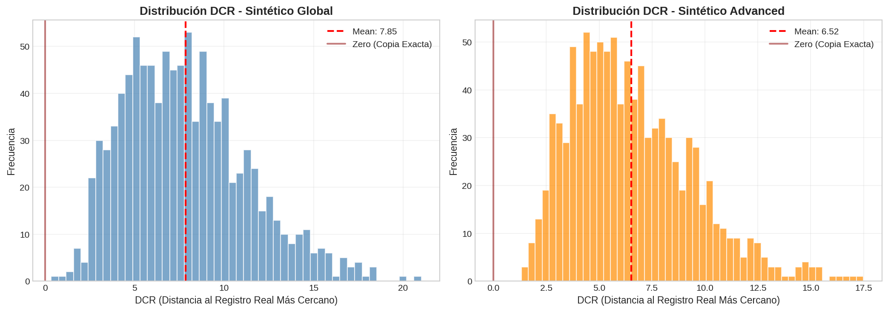
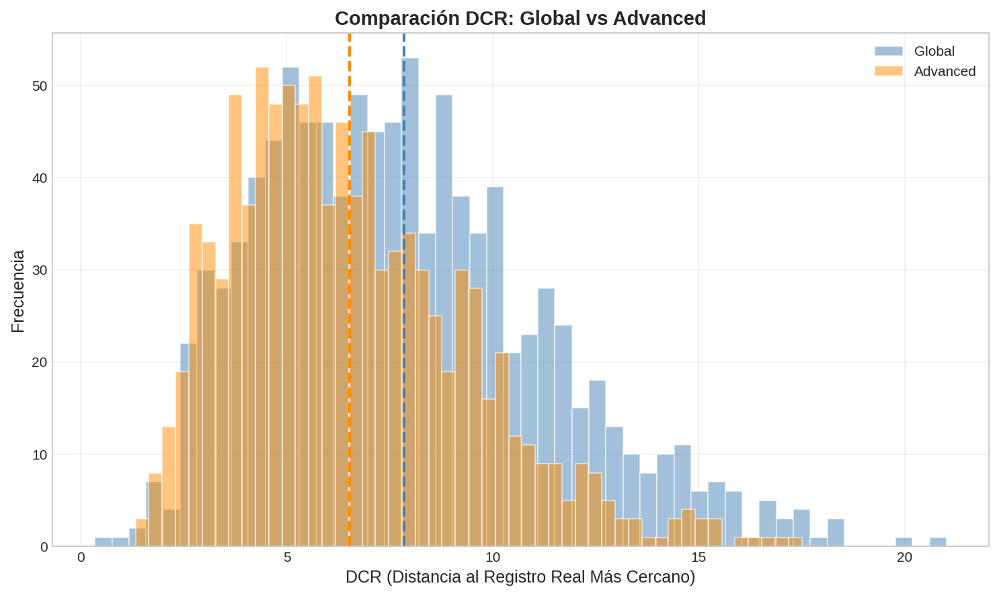

# 🔒 Resultados Auditoría de Privacidad

**Fecha:** 2026-01-08  
**Versión:** v3_experimental  
**Fase:** Prompt 7 - Chequeo de Memorización

---

## ✅ Conclusión Principal

| Resultado | Estado |
|-----------|--------|
| **Memorización Detectada** | ❌ No |
| **Aprobado para Uso** | ✅ Sí |

> Los datos sintéticos **NO presentan copias exactas** de registros reales y pueden usarse sin comprometer privacidad.

---

## 📊 Copias Exactas

| Método | Copias | Total | Porcentaje |
|--------|--------|-------|------------|
| **Global** | 0 | 1,000 | 0.00% ✅ |
| **Advanced** | 0 | 1,000 | 0.00% ✅ |

---

## 📏 Estadísticas DCR (Distance to Closest Record)

| Métrica | Global | Advanced |
|---------|--------|----------|
| **Mínimo** | 0.348 | **1.331** ✅ |
| **Máximo** | 21.02 | 17.50 |
| **Media** | 7.85 | 6.52 |
| **Mediana** | 7.43 | 6.08 |
| **Std** | 3.43 | 2.85 |

### Interpretación

- **DCR = 0**: Copia exacta (CRÍTICO) - No encontrado ✅
- **DCR < 0.5**: Muy cercano - Solo 1 registro en Global
- **DCR ≥ 1.0**: Diferenciado - 100% en Advanced ✅

---

## 🎯 Evaluación de Riesgo

| Método | Alto Riesgo | Medio Riesgo | Nivel Global |
|--------|-------------|--------------|--------------|
| **Global** | 1 (0.1%) | 0 | 🟢 BAJO |
| **Advanced** | 0 (0.0%) | 0 | 🟢 BAJO |

> El método **Advanced (condicional)** tiene mejor perfil de privacidad con DCR mínimo de 1.33.

---

## 📈 Visualizaciones

### Histograma DCR

### Comparación Global vs Advanced

---

## 📁 Archivos Generados

| Archivo | Descripción |
|---------|-------------|
| `07_Privacy_Audit.ipynb` | Notebook original |
| `07_Privacy_Audit_executed.ipynb` | Notebook ejecutado |
| `privacy_report.json` | Reporte JSON |
| `dcr_histogram.png` | Histogramas separados |
| `dcr_comparison.png` | Comparación overlay |

---

## ➡️ Siguiente Paso

✅ **Datos aprobados para entrenamiento TSTR**

Proceder al entrenamiento con los escenarios de augmentación definidos en el protocolo.

---

## 📚 Referencias

- Jordon et al. (2022) - Synthetic data evaluation metrics
- SDV Documentation - Privacy evaluation
